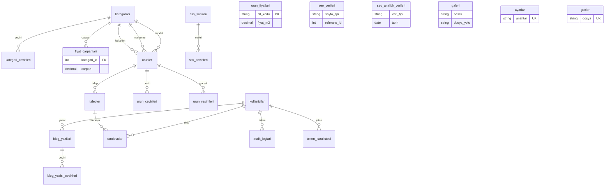

# Veritabanı Şeması — Kamelya (mermaid ER)

İlkeler: InnoDB + `utf8mb4_unicode_ci`; PK `id BIGINT UNSIGNED AUTO_INCREMENT`;
`created_at/updated_at` her tabloda; soft delete (`deleted_at`) ürün/blog;
`RESTRICT` varsayılan FK, `CASCADE` çeviri/görsel/çarpan, `SET NULL` iş izleri.
